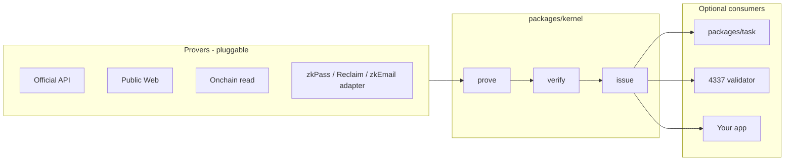

# VeriCommons

**Backend-agnostic `issue()` of a credential you can customize, on top of open-source prove/verify whose default verify is a decentralized network of at least three verifier nodes (2-of-3, then one ticket).** That is the unique value: we are the issuer, engines are pluggable, and verify is not a single company's check.

We ship this kernel for our Task Plaza, and as a public component others can import.


```
prove (ours or theirs) → verify (≥3 independent operators) → issue() your credential
```

Plaza, credits, and 4337 only consume the ticket. They never parse zkPass / Reclaim blobs.

## Packages

| Package | Role | Required to reuse the kernel? |
| --- | --- | --- |
| [`packages/kernel`](packages/kernel) | `prove` / `verify` / `issue`, schemas, trust labels | **Public core** |
| [`packages/task`](packages/task) | Bind ticket ↔ `taskId`, PASS / FAIL / PENDING, credit hook | No — plaza only |
| [`packages/aa`](packages/aa) | Off-chain 4337 gate + EIP-1271 subject bind | No |
| [`packages/contracts`](packages/contracts) | `EvidenceTicketValidator`, `EvidenceRegistry`, `SubjectBinder` | No |

Default ticket: EIP-712 `EvidenceTicket`. Another app uses the same kernel with **its issuer key**, **its schemas**, and later **its credential profile** (e.g. W3C VC).

## Core flow



Immediate facts verify now. Delayed facts stay PENDING until `attribution.qualified`. Same `issue()`.

## How other developers use this

1. **Kernel only** — import `@vericommons/kernel`, your signer, your schemas.
2. **Your issuer profile** — keep `verify()`; swap ticket types when you need VC / another EIP-712 name.
3. **Our plaza** — `packages/task`; credits see `{ evidenceId, schema, subject, amount }` after PASS.
4. **Vendor under the kernel** — their `verify()` → map → **your/our** `issue()`, with `trust.assumption`.
5. **4337 adapter** — consume the ticket; do not verify zkTLS in a UserOp.

DVT deploy (three verifier hosts + one issuer): [Ecosystem](docs/Ecosystem.md).

## Status

| Phase | What | PR |
| --- | --- | --- |
| P1 | Kernel | on `main` |
| P2 | Plaza / credits wrapper | open — do not self-merge |
| P3 | 4337 + onchain prover | stacked on P2 |
| P4 | Vendor adapters | not started |
| P5 | Run the ≥3-node verifier network | not started; `verifierSet` is the hook |

## Develop

```bash
pnpm install
pnpm test
pnpm build
```

- [Architecture](docs/Architecture.md) · [full stack](docs/architecture-full.svg)
- [Ecosystem / DVT](docs/Ecosystem.md) · [DVT diagram](docs/architecture-dvt.svg)
- [Milestones](docs/plan/README.md) · [Changes](docs/Changes.md)
- [Solution](docs/Solution.md) (do not overwrite)
