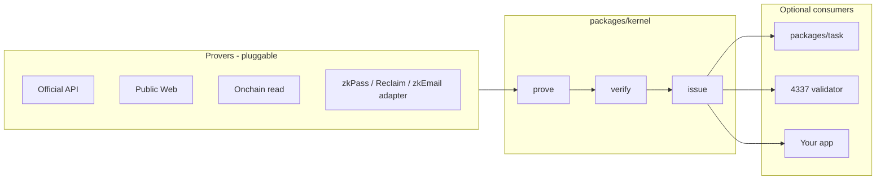

# VeriCommons

Backend-agnostic **prove → verify → issue** kernel, plus optional packs for our Task Plaza, credits, and ERC-4337 accounts.

We ship **VeriCore** for that plaza. The kernel is a **public, composable component**: other apps can import it, plug their own provers and verifiers, and issue **their** credentials. We do not have to be the only issuer on the planet. We are the default issuer for our task ecosystem.

```
Prover (ours or theirs)
  → verify (ours, or trust their SDK)     // record verifierSet + trust.assumption
    → issue()  a credential               // default: our EIP-712 Evidence ticket
```

`issue()` is the product. Plaza, credits, and 4337 never parse zkPass / Reclaim blobs.

**Today:** one operator runs `verify()` (honest centralized). **P5:** independent verifier operators, quorum, then one `issue()`. See [Ecosystem](docs/Ecosystem.md) and [DVT SVG](docs/architecture-dvt.svg).

## Why this repo exists

| Audience | What we are |
| --- | --- |
| Our stack | The middle: Task Plaza → **did they finish?** → credits / 4337 |
| Other developers | A swap-in kernel: bring a prover, bring a verifier, mint a ticket |
| Not this repo | Plaza UI, credit ledger, a full 4337 account, a zkTLS network |

zkPass and zkEmail are useful **engines**, not the trust root. ZK does not mean decentralized verify.

## Packages

| Package | Role | Required to reuse the kernel? |
| --- | --- | --- |
| [`packages/kernel`](packages/kernel) | `prove` / `verify` / `issue`, schemas, trust labels | **This is the public core** |
| [`packages/task`](packages/task) | Bind ticket ↔ `taskId`, PASS / FAIL / PENDING, credit hook | No — plaza only |
| [`packages/aa`](packages/aa) | Off-chain 4337 gate + EIP-1271 subject bind | No |
| [`packages/contracts`](packages/contracts) | `EvidenceTicketValidator`, `EvidenceRegistry`, `SubjectBinder` | No |

Default `issue()` profile: EIP-712 `EvidenceTicket` (`VeriCommons` / `0.1`). That profile is what plaza and 4337 consume. Another app can use the same kernel with **its own issuer key**, **its own schemas**, and later **its own credential profile** (for example a W3C VC). That last hook is designed; it is not a second wire format in P1–P3.

## Core flow



Immediate facts (GitHub star, public page, NFT hold) verify now. Delayed facts (WeChat-class) stay PENDING until an `attribution.qualified` ticket is issued. Same `issue()`, different proof type.

## How other developers use this

**1. Kernel only (public component)**  
Import `@vericommons/kernel`. Register schemas. Use our Public Web / API / onchain backends, or add a `ProofBackend`. Call `prove` → `verify` → `issue` with **your** issuer signer. Downstream you write is yours.

**2. Kernel + your issuer profile**  
Keep `verify()` as the gate. Swap `TicketIssuer` domain / types when you need a different credential (VC, another EIP-712 name). Do not fork plaza code for that. P1–P3 still only ship the VeriCommons ticket; the split is the point of the design.

**3. VeriCore for the task ecosystem**  
`packages/task` on top of the kernel. Plaza never talks to a vendor SDK. Credits only see `{ evidenceId, schema, subject, amount }` after PASS.

**4. Vendor engines under the kernel**  
Their SDK `verify()` → map claim → **our** `issue()` (or yours). Label `trust.assumption` (`VENDOR_ZKPASS`, …). You are trusting their verifier, not re-running their TLS.

**5. 4337 adapter only**  
Accounts consume the ticket (signature or `hasEvidence`). They must not verify zkTLS in a UserOp.

## Decentralized verify (target)

Three independent **verifier operators**, not three threads in one process. Each operator runs a verifier process (our binary or theirs). A **quorum** (for example 2-of-3) is required before **one** `issue()`. The issuer is a separate role. Detail, deployment, and “does P1–P3 already satisfy this?”: [docs/Ecosystem.md](docs/Ecosystem.md).

## Status (do not merge phase PRs yourself)

| Phase | What | PR |
| --- | --- | --- |
| P1 | Kernel | on `main` |
| P2 | Plaza / credits wrapper | open — review, do not self-merge |
| P3 | 4337 consume + onchain prover | stacked on P2 |
| P4 | Vendor adapters | not started |
| P5 | Multi-verifier / DVT | not started; fields `verifierSet` + `trust.assumption` are the hook |

## Develop

```bash
pnpm install
pnpm test
pnpm build
```

Node 22+. Foundry for `packages/contracts`. Vendor clones (gitignored): `bash vendor/clone.sh`.

- [Architecture](docs/Architecture.md) · [full stack SVG](docs/architecture-full.svg)
- [Ecosystem / DVT](docs/Ecosystem.md) · [DVT SVG](docs/architecture-dvt.svg)
- [Milestones](docs/plan/README.md) · [Changes](docs/Changes.md)
- [Solution](docs/Solution.md) (source notes — do not overwrite)
