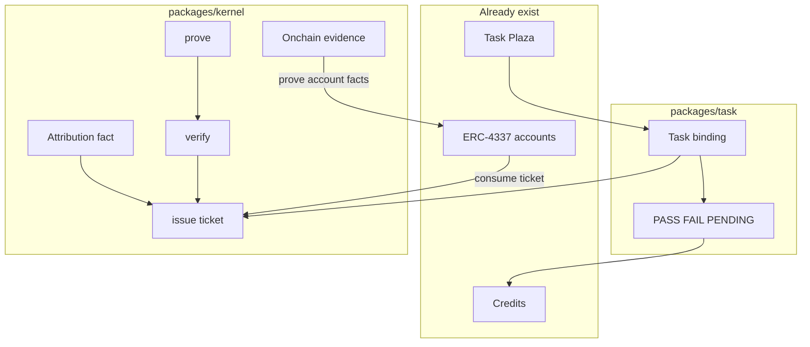
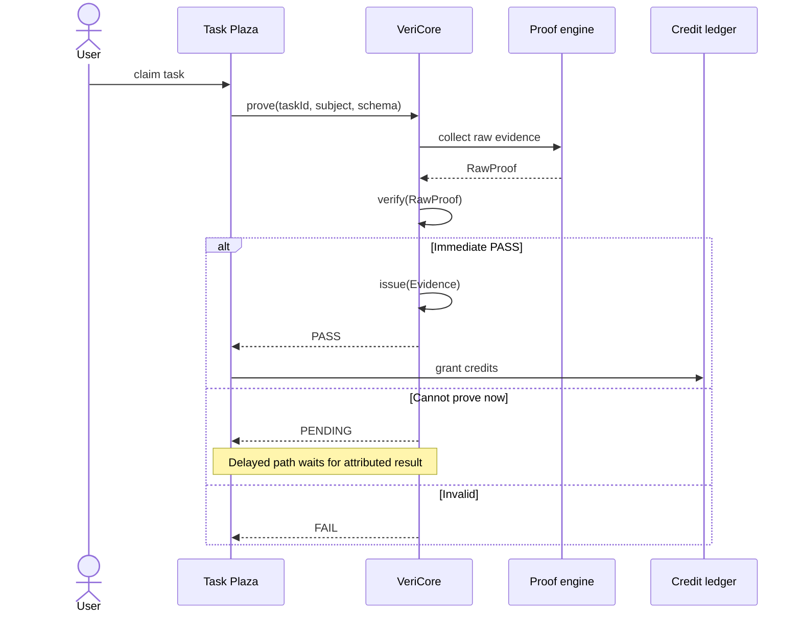
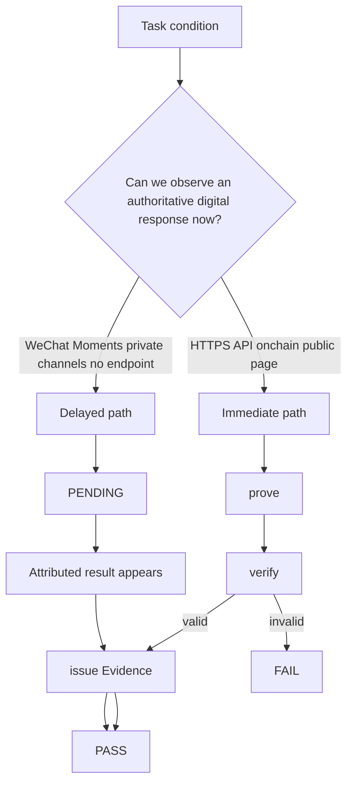
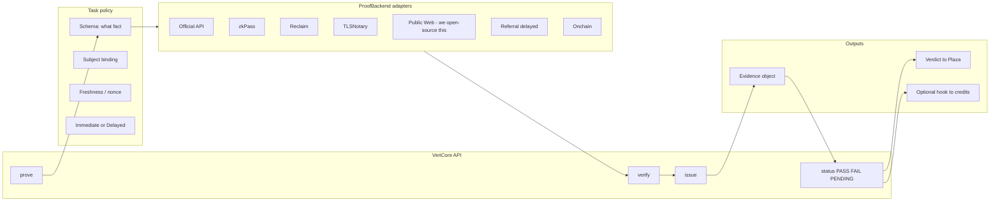

# Architecture — Two layers

> Kernel (`packages/kernel`) is reusable: prove / verify / issue, same three steps as a zkPass-style kernel.
> Task wrapper (`packages/task`) serves the existing Task Plaza only.
> Attribution **facts** live in the kernel. Task **policy** (this task is done) lives in the wrapper.
>
> Canonical SVG (merged, use this one): [architecture-full.svg](./architecture-full.svg)
>
> Older splits kept: [two layers](./architecture-two-layers.svg) · [prover stack](./architecture-stack.svg)

Protocol namespace: **VeriCommons**. Kernel package: **`@vericommons/kernel`**. Plaza-facing product: **VeriCore** = kernel + `packages/task`.

---

## 0. Two-layer split

```
Task Plaza / Credits / ERC-4337     already exist
        │
        ▼
packages/task     LAYER 2  plaza wrapper
  taskId, caps, PENDING, credit hook
        │  consumes entry tickets
        ▼
packages/kernel   LAYER 1  reusable
  prove → verify → issue(entry ticket)
        │
        ▼
Provers: our Public Web · API · TLSNotary · zkPass/Reclaim adapters · Onchain
```

| Goes in kernel | Goes in task wrapper | Stays outside this repo |
| --- | --- | --- |
| prove / verify / issue | bind ticket → taskId | Task Plaza UI |
| Evidence object (entry ticket) | PASS / FAIL / PENDING for a task | Credit issuance contracts |
| Attribution **fact** (B via channel A) | whether that fact **completes this task** | 4337 account implementation |
| Onchain prover (read 4337/NFT/logs) | plaza / ledger adapters | Paymaster / bundler infra |
| Vendor prover adapters | task caps / expiry | |

**Attribution:** do **not** bury it only in the plaza wrapper, and do **not** mix it into zkTLS.

- Kernel issues `attribution.qualified` evidence: “subject B had a qualified event, bound to channel of A”. Reusable for growth, login bonus, or 4337 session policy — not only tasks.
- Task wrapper decides: “task T completes when such a ticket exists, once, within window W”.

If we put attribution only in the task package, kernel users cannot reuse “who brought whom”. If we put taskId inside the kernel, the kernel is no longer independent.

---

## 1. What we ship

**Kernel** is the zkPass-like core: obtain proof, verify it, issue an entry ticket. Others can take `packages/kernel` alone. We can also plug **their** prover and still `issue()` **our** ticket (`verifierSet` recorded).

**Task wrapper** is the extra pack for our plaza: task-level certification on top of tickets.

---

## 1.1 ERC-4337 — two arrows, both real, different jobs

Smart accounts **can** use this system. They **cannot** run zkTLS inside the contract.

### Arrow A — account CONSUMES an entry ticket (login / policy)

**Possible.** This is the “offline credential → 进门条” path.

1. Kernel `issue()` a signed Evidence (EIP-712 today, VC later), with `validUntil`.
2. Optionally store `evidenceHash` on-chain (our registry or EAS).
3. A 4337 **validator module**, **paymaster**, or **session-key issuer** checks the ticket.

What the chain can check in `validateUserOp`:

- `hasEvidence(sender, schemaId)` if we anchored the hash
- issuer ECDSA / EIP-1271 signature over the ticket (not a zkTLS transcript)
- a session key that was minted **after** kernel.verify() off-chain

What the chain must **not** do: verify a full zkPass/TLSNotary blob in the UserOp. Too heavy. Web2 fact stays off-chain; 4337 only sees our ticket.

Standard ERC-4337 vs our custom account: **same kernel**. Difference is which **module** we install (validator vs paymaster vs session).

This can replace *some* off-chain login checks: “this UserOp is allowed because the owner holds ticket X”. It does not replace the 4337 signature itself (the account still must authorize the UserOp).

### Arrow B — account is a SOURCE of facts (Web3 credentials)

**Possible, and easier than Web2.** The kernel `OnchainProver` reads chain state / logs:

- owner, enabled module, guardian
- a UserOp was executed
- token / NFT / SBT balance
- event logs

The contract does **not** “generate the proof”. A relayer/indexer reads the chain, then kernel `issue()`. The account can **EIP-1271-sign** subject binding (“this account is the subject”), which is control of the account, not GitHub.

### Impossible inside the account

HTTPS, GitHub, WeChat, a zkPass TLS session. No contract can fetch Web2. Those stay L2 Web2/zkTLS provers, then Arrow A binds the ticket to the 4337 address.

---


## 2. Ecosystem position

zkPass / Reclaim / vlayer / TLSNotary are **optional proof engines below us**, not competitors we must beat, and not layers we sit under.



| Layer | Who | Role |
| --- | --- | --- |
| App | Task Plaza | Publish tasks, show progress |
| **This component** | **VeriCore** | Decide completion; emit a normalized evidence object |
| Settlement | Our credit / account contracts | Spend or grant credits — operations, not this repo’s kernel |
| Proof engines | zkPass, Reclaim, TLSNotary, vlayer, GitHub API | Produce or check a raw proof of one Web2/Web3 fact |
| Chain primitives | EAS / Sign / our EvidenceRegistry | Optional anchor of a hash; not required for v0 |

Relation to zkPass / Reclaim / vlayer:

- **Not competition** for our business goal.
- **Not a lower-level protocol they must implement.**
- **Adapters:** if they are open enough to embed, VeriCore calls them as a prover. Native schema sharing does **not** exist. Interop = map their verify-result into our Evidence.
- **Trust:** we do **not** re-run their TLS. After their SDK / attestor says OK, we `issue()` our evidence with `verifierSet = zkPass` (or Reclaim). That is an explicit trust assumption, recorded, not hidden.

zkPass as a **product** is the same three steps packaged vertically: their zkTLS prove + their verify network + their credential + login/email pass. VeriCore can sit on the same three steps. We *could* build a zkPass-like login product by adding our own zkTLS prover and UX. We do not need to. The plaza only needs the verdict.

“Backend-neutral backend” = **prover engine** (L2 in the SVG): our Public Web, official APIs, self-hosted TLSNotary, or a vendor adapter. Self-hosted and open-sourced Public Web (and later TLSNotary) matters because vendor provers need their network to cooperate.

Delayed attribution is a **kernel evidence type**, not zkTLS. Task wrapper only decides whether that ticket completes a plaza task.

---

## 3. zkPass and zkTLS

Yes. zkPass is zkTLS-class: **3P-TLS + VOLEitH / hybrid ZK**. Same family as Reclaim and TLSNotary, different trust and product packaging.

Can our Schema / Credential “run on zkPass”?

- **Not plug-and-play.** zkPass has its own schema marketplace and proof format.
- **Yes as a backend.** We write `ZkPassBackend`: call TransGate / their SDK, then map a successful verification into our object.
- **Interop** means adapter, not wire compatibility. Same as Reclaim and TLSNotary.

We do **not** need zkPass to adopt VeriCommons for our plaza to work.

---

## 4. prove / verify / credential — what the three functions do

`prove` is **not** “the verifier”. In cryptography:

| English | Who | Chinese | Does |
| --- | --- | --- | --- |
| **prove()** | Prover 证明生成方 | 取证 / 出示证明 | 按任务条件去拿原始证据，产出一份还不能直接发积分的 `RawProof` |
| **verify()** | Verifier 验证方 | 核验证明 | 检查这份 proof 是否来自声称的来源、有没有被改、谓词是否成立 |
| **credential()** / better name **issue()** | Issuer 发证方 | 发凭证 | 把核验通过的结果做成广场和积分系统只认的规范化对象 |

Airport analogy:

```
prove     = show passport          拿出材料
verify    = border control checks  海关核验真伪
issue     = stamp the landing slip 盖章放行条，后面只认这张条
```

`VC` = **W3C Verifiable Credential**（可验证凭证），不是 “verify credential” 三个单词的随便缩写，是一套已有的凭证数据模型。我们内部对象可以对齐成 VC profile，但这不是第一刀必须对外讲的故事。

Flow:



Plaza never talks to zkPass. Ledger never parses a zkTLS blob. They only consume `PASS | FAIL | PENDING` plus an evidence id.

---

## 5. Immediate vs delayed verification

This is the real product logic.



**Immediate:** GitHub star/PR, Discord role, public blog challenge, onchain hold. Engine reads HTTPS/API/chain → proof → verify now.

**Delayed (long-term verifiable):** WeChat Moments, private groups, channels we cannot fetch. Do **not** fake a zkTLS proof. Issue a **referral / channel id**. When a new user registers and qualifies, that **result** is the proof. Same `issue()` object, `proofType = RESULT_ATTRIBUTION`.

Delayed is still verification. It verifies **outcome**, not **share action**.

---

## 6. Internal structure of VeriCore



**Public Web verifier:** yes, we should own a small open-source implementation (fetch URL, check backlink + challenge). That is the one engine we are not renting. It is how “not bound to any prover vendor” becomes real, not a slogan.

We do **not** need to open-source a zkTLS stack. Use theirs if license and embeddability work (watch Reclaim AGPL).

---

## 7. Core value — if not “a JSON standard others adopt”

For **our business**, others do not need to adopt VeriCommons.

| Not the value | The value |
| --- | --- |
| Force zkPass to speak our JSON | Plaza and ledger stay stable while engines change |
| Win an industry standard war | Immediate + delayed completion in one verdict model |
| Rebuild zkTLS | Embed open engines; write only the missing delayed path and glue |
| Define JSON for its own sake | Schema makes “what counts as done” explicit, testable, auditable **inside our org and for task creators** |

“Backend-neutral evidence format” here **backend = proof engine** (zkPass, GitHub API, referral tracker), not “our Node/Worker server”.

“Auditable schema commons” here means: task conditions are **versioned, public to our creators, testable**, not “IETF RFC that Reclaim must implement in 2026”.

---

## 8. Naming

| Layer | Name | Why |
| --- | --- | --- |
| Repo / format | **VeriCommons** | Evidence + schema namespace |
| Kernel directory | **`packages/kernel`** / `@vericommons/kernel` | prove / verify / issue; others may reuse |
| Plaza wrapper | **`packages/task`** / `@vericommons/task` | task-level certification |
| Product name | **VeriCore** | kernel + task, what we ship to the plaza |
| SDK entry | `prove` `verify` `issue` | CLI `veri prove` is a command, not the product |

Do **not** name the product VeriProve. `prove` is only step one.

---

## 9. What we actually need to build

Already exists (do not rebuild): Task Plaza, smart accounts, credit issuance.

Build now:

1. VeriCore API: `prove` / `verify` / `issue` / `status`
2. One immediate backend (official API or Public Web; zkPass/Reclaim if already easy to embed)
3. One delayed backend (referral / channel id → qualified signup)
4. Adapter: plaza `taskId` in, ledger grant hook out
5. Internal evidence object (can look like a VC later)

Do not build first: industry schema politics, browser extension, NL compiler, permissionless notary network, transferable token.
