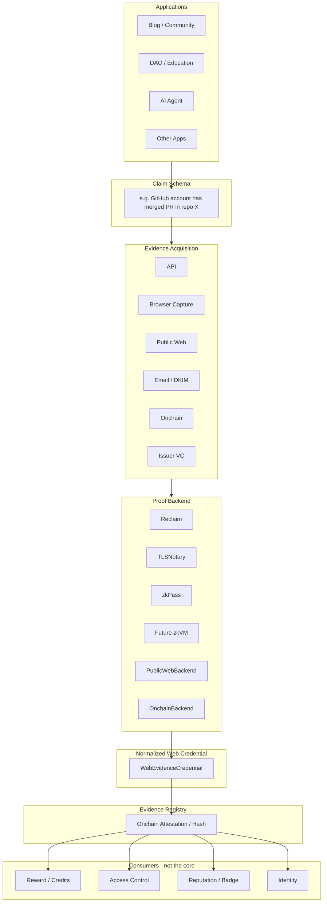
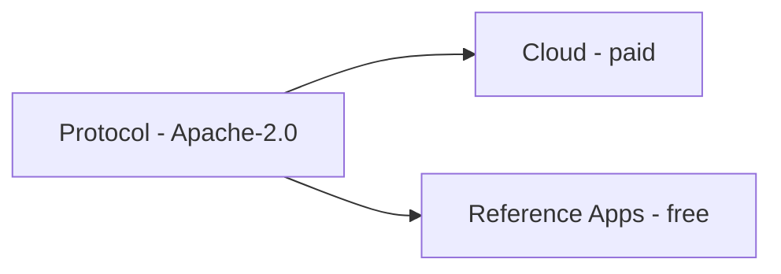

# Design — VeriCommons Architecture

> Current split: **kernel** (`prove` / `verify` / `issue`) + **task wrapper** for the plaza. See [Architecture.md](./Architecture.md) and [architecture-two-layers.svg](./architecture-two-layers.svg).
>
> ERC-4337: accounts can **consume** offline tickets (Arrow A) and can be an **onchain evidence source** (Arrow B). They cannot generate zkTLS / Web2 proofs.

> Derived from `docs/Solution.md`. **Current position is in [Architecture.md](./Architecture.md).** This file keeps the longer protocol/credential notes as internal design, not as “we must become an industry zkTLS product”.

**Correction 2026-08-25:** We already have Task Plaza (upstream) and credits / smart accounts (downstream). This repo is **VeriCore** — the task completion verifier in the middle. zkPass / Reclaim / TLSNotary / vlayer are optional engines we embed. Immediate proof when a digital response exists; delayed attribution when it does not (WeChat Moments, etc.). Credits settlement is operations, not this kernel.

---

## 1. Product Definition

**VeriCore** (repo / format namespace: **VeriCommons**) verifies whether a plaza task was completed.

Primary API:

```
prove()    // collect RawProof
verify()   // check that proof
issue()    // formerly credential(): emit normalized Evidence
status()   // PASS | FAIL | PENDING
```

Plaza does not parse zkTLS. Ledger does not care which engine ran.

The durable internal asset is still a backend-neutral evidence object — **backend = proof engine**, so we can swap zkPass for GitHub API without rewriting the plaza. That is an integration format for **our** stack. It is not a campaign to make zkPass implement our JSON.

Do not rebuild: Task Plaza, credit issuance, a new zkTLS stack, an onchain quest platform.

---

## 2. What We Actually Prove

Protocol language is **provenance**, not universal truth.

We can prove:

```
At time T,
server S returned data D
for authenticated context U.
```

We cannot automatically prove that `D` is absolute real-world truth.

Example: LinkedIn returns `Alice works at OpenAI`.

- Proven: LinkedIn returned that statement at time T for authenticated context U.
- Not proven: Alice actually works there in the physical world.

Five conditions for a Provable Web Fact:

```
Authoritative Source
× Observable HTTPS Response
× Subject Binding
× Deterministic Predicate
× Freshness
```

Missing one item weakens the proof. Missing two or more usually means zkTLS is the wrong backend.

Judging a platform is not "does it have a public API?". The correct question is:

> When the user obtained this fact, was there an authoritative digital response whose origin can be proven?

- No public API: still possible via browser zkTLS, if the browser sees the HTTPS response.
- No observable authoritative digital response: unsupported (personal WeChat Moments, private E2EE chats).

---

## 3. Layered Architecture

The conversation evolved from a five-layer Task Protocol into an Evidence Protocol. The latter is canonical. Task / Reward sit below Evidence as optional consumers.



Credits, badges, tokens, Discord roles, API quota, and AI tokens all consume Evidence. They are replaceable. Evidence is not.

---

## 4. Canonical Data Object: EvidenceCredential v0.1

This standard is the core asset of VeriCommons. Every backend must emit the same object.

```ts
interface EvidenceCredential {
  version: "0.1"

  // who owns this evidence
  subject: string

  // Web2 authoritative source
  source: {
    origin: string
    type: "https" | "onchain" | "issuer"
  }

  // what is being proven
  schema: string
  claim: Record<string, unknown>

  // privacy-preserving Web2 identity binding
  subjectNullifier?: string

  issuedAt: number
  validUntil?: number

  proof: {
    type: string
    backend: string
    reference: string
    hash: string
  }
}
```

Example:

```json
{
  "schema": "github.repo.star.v1",
  "source": {
    "origin": "api.github.com",
    "type": "https"
  },
  "claim": {
    "repo": "tlsnotary/tlsn",
    "starred": true
  }
}
```

Richer form used in protocol discussion (`WebEvidenceCredential`):

```
schemaId
subject
sourceOrigin
sourceAccountNullifier
claim
proofType
evidenceHash
issuedAt
validUntil
verifierSet
proofReference
```

Example:

```
schemaId: github.repo.star
subject: 0xAlice
sourceOrigin: api.github.com
sourceAccountNullifier: 0x83FA...
claim: { repo: "foo/bar", starred: true }
issuedAt: 2026-08-24T...
proofType: BROWSER_ZKTLS
```

After this object exists, Reward Contract / Identity Protocol / DAO / AI Agent / Access Control only read the Credential. They do not need to know whether the backend was Reclaim or TLSNotary.

**Do not let our Credential Format equal Reclaim Proof Format.** Reclaim is an adapter, not the protocol.

---

## 5. ProofBackend Abstraction

From day one:

```ts
interface ProofBackend {
  prove(request: EvidenceRequest): Promise<RawProof>
  verify(proof: RawProof): Promise<VerifiedEvidence>
  capabilities(): ProofCapability[]
}
```

Backends:

```
ProofBackend
├── ReclaimBackend        MVP / fast production
├── TLSNotaryBackend      long-term autonomous path
├── zkPassBackend         product / schema UX reference
├── PublicWebBackend      HTTP challenge / backlink
├── OnchainBackend        ownerOf / balanceOf / logs
└── future zkVMBackend    the3cloud / vlayer / succinct compression
```

Selection rationale is in `docs/Tech-zkTLS.md`.

Rule:

- Reclaim for MVP speed
- TLSNotary as VeriCommons' own technical path (MIT/Apache-2.0, self-hostable)
- Never make the core protocol an AGPL fork of `reclaimprotocol/zk-fetch`

Target shape:

```
Application
  │  "I need github.repo.star proof"
  ▼
VeriCommons
  ├── Reclaim
  └── TLSNotary
        ↓
  same EvidenceCredential
```

---

## 6. Proof Strength Ladder

These five grades remain part of the design. They are not all zkTLS.

| Grade | Type | Trust | Typical use |
| --- | --- | --- | --- |
| A | Onchain Proof | Strongest, can be trustless | NFT hold, token balance, contract state |
| B | Signed API Proof | Verifier-signed EIP-712 | GitHub / Discord / SaaS official API |
| C | Web Proof | Fetch + challenge | Blog publication, backlink, domain control |
| D | AI / Human Proof | Must declare proofType and score | Tutorials, qualitative contribution |
| E | ZK Proof | Circuit + onchain verifier | Account age / membership without revealing identity |

zkTLS sits across B and C: it turns authenticated HTTPS into a cryptographic proof so the app server is no longer the only trust source.

Onchain evidence must explicitly record `proofType`. Never pretend AI review equals cryptographic proof.

---

## 7. Four Easy-to-Miss Protocol Problems

These must be in the spec, not left to apps.

### A. Subject Binding

Proving "some GitHub account starred a repo" is not enough. Must bind:

```
Wallet / Smart Account
↔ Web2 account ID
↔ challenge
↔ nullifier
```

Otherwise rewards can be claimed by a different subject than the Web2 actor.

### B. Freshness

A proof that Alice follows Bob today cannot be a two-year-old proof reused forever.

Credential must include `issuedAt / validUntil / nonce / taskContext`.

### C. State ≠ Action

API `following = true` proves current follow state, not that the user followed after joining the campaign.

Some tasks need `before proof + after proof`, or server timestamp + challenge + campaign-specific data.

### D. Persistence

`liked = true at T1` does not imply `liked = true at T1 + 7 days`.

If reward requires continued state:

```
T1 proof → vesting → T2 re-proof → reward settled
```

This is Reward Policy, not zkTLS.

### Sybil is a separate layer

100 Discord accounts ≠ 100 humans. Keep:

```
Web Credential
  + Identity Credential
  + Sybil Score
  → Reward Policy
```

Human Passport / Gitcoin Passport is a later option, not v0.

---

## 8. Onchain Surface

### 8.1 Do not invent attestation primitives in MVP

Compare and adapt:

- **EAS**: Schema Registry + Attestation Contract + optional Resolver. Onchain/offchain attestations.
- **Sign Protocol**: Schema + Attestation + Schema Hook + Indexing + IPFS/Arweave + ZK verification. Closer to this product.

Innovation is Task / Verifier / Reward orchestration and the EvidenceCredential, not a new attestation registry.

### 8.2 First onchain object: EvidenceRegistry

Do not store the full proof onchain. Store:

```solidity
struct Evidence {
    bytes32 schemaId;
    address subject;
    bytes32 claimHash;
    bytes32 evidenceHash;
    uint64 issuedAt;
    uint64 validUntil;
}
```

Functions:

```
verifyEvidence()
hasEvidence()
getEvidence()
revokeEvidence()
```

### 8.3 Later contracts (after Evidence works)

Five-contract split from the task-protocol round, still valid as an optional rewards layer:

1. `TaskRegistry` — metadataURI + metadataHash, not kilobytes of description
2. `VerifierRegistry` — verifier identity, proofType, status
3. Attestation adapter
4. `RewardManager` — `settle(attestation)`
5. `CreditLedger` — multi-tenant, non-transferable

```
createTask() → complete → verify() → attest() → claim() → settle() → credit()
```

These six verbs can become the rewards SDK. They are **M7**, not M1.

### 8.4 Credits on chain

Do not ship transferable ERC-20 in v1.

```
mapping(uint256 projectId => mapping(address user => uint256 balance)) credits;
```

Split:

- Credit = spendable
- Reputation = not spendable
- Badge = optional ERC-5192 soulbound NFT
- ERC-6909 = later, if one contract must manage many point assets

### 8.5 Verifier trust evolution

```
MVP: official whitelist
 → multiple trusted verifiers
 → permissionless verifier + stake + challenge + slash
```

Verifier Marketplace is a long-term moat: GitHub, Telegram, URL, code contribution, AI evaluation, course completion, event check-in, Shopify, Stripe, DAO vote.

Positioning if it grows:

> Zapier / Chainlink, specialized for proving that a human or agent completed a digital action.

---

## 9. UX: Users Must Not Feel Web3

Even if settlement is onchain, Blog / ordinary users must not be asked to install MetaMask, buy ETH, switch network, or pay gas.

```
Email / Passkey
  → Smart Account
  → Address
  → Evidence / Task Proof
  → Sponsored transaction (ERC-4337 Paymaster)
```

Visible UX:

```
Sign in with email
Credits: 8
Complete task
✓ Verified
+5 credits
```

EIP-712 / EIP-1271 handle structured verifier signatures for smart accounts.

---

## 10. Product Split: Protocol / Cloud / App



### Protocol (open source)

- EvidenceCredential spec
- Schema Registry
- ProofBackend interface
- EvidenceRegistry
- SDK
- later: TaskRegistry / VerifierRegistry / RewardManager / CreditLedger

### Cloud (paid)

- Verifier APIs
- Indexer
- GraphQL / REST
- Dashboard
- Webhook
- AI Verification
- Anti-Sybil
- Gas Sponsorship
- Analytics
- Schema / endpoint health monitoring

### App (free reference)

- Quest / Claim UI
- Profile
- Credit page
- Leaderboard
- First production app: technical Blog + AI Search credits

Commercial model (optional, not the public-goods core):

| Offer | Pricing idea |
| --- | --- |
| Protocol | free / open source |
| Hosted Verification | $xx / month |
| API Verification | $ per 1K proofs |
| AI Verification | usage based |
| Gas Sponsorship | usage based |
| Enterprise Verifier | custom |

---

## 11. First Reference Application: Technical Blog

The original Blog AI Search is **dogfooding**, not the protocol.

Blog rules that remain valid:

- Reading stays free
- Ordinary hybrid search can be generous / free for logged-in users (Vectorize + BGE-M3 + reranker is cheap)
- Ask AI / Deep Answer consume Credits
- Earn Credits by verified contribution and qualified referral, not by "share to Moments"

Flow:

```
Digital Commons Blog
  ├── Sign up → +3 Credits
  ├── Refer qualified reader → ReferralVerifier → Evidence → +5
  ├── Submit useful AI repo → AIReviewVerifier → Evidence → +5
  └── Fix article error → HumanVerifier → Evidence → +10

AI Search → consume(projectId, user, 2)
```

Search stack (reference app only):

```
Blog content → chunk/metadata
  → D1 FTS5 + Vectorize
  → RRF
  → optional BGE reranker
  → results
       ├─ open article (free)
       └─ Ask AI (credits)
```

Cost control stack:

```
Turnstile → Account → Worker Rate Limit → Credit Check → AI Gateway Spend Limit → Workers AI
```

Rate limit ≠ billing. Credits live in a ledger (D1 first, later CreditLedger).

Anti-abuse: Account + Verified Email + Turnstile + user-id rate limit + session/browser signal + IP risk + referral graph + behavior pattern. Referral rewards stay PENDING until qualified.

UI should show Invite / Submit resource / Report error / Improve article. It should **not** show "Share to Twitter +3 / Share to WeChat +3".

---

## 12. Open Public Goods Design

License: **Apache-2.0** for protocol, SDK, contracts, TLSNotary adapter.

Specification: CC BY 4.0 or similar for RFC / Schema.

VCIP series:

| ID | Topic |
| --- | --- |
| VCIP-0001 | Evidence Credential |
| VCIP-0002 | Schema Definition |
| VCIP-0003 | Proof Backend Interface |
| VCIP-0004 | Subject Binding |
| VCIP-0005 | Freshness & Replay |

Five invariants:

```
No mandatory token
No mandatory chain
No mandatory prover
No mandatory verifier
No vendor lock-in
```

Schema properties of a public good:

- public
- versioned
- forkable
- auditable
- includes test vectors and security assumptions

---

## 13. Schema Object

Each schema in the registry should contain:

```
ID
Description
Source
Required Request
Predicate
Privacy fields
Freshness policy
Supported Backends
Test vectors
Security assumptions
```

Example:

```
id: github.repo.star.v1

source:
  origin: api.github.com

claim:
  repo: string
  starred: boolean

proof:
  supported:
    - reclaim
    - tlsnotary

privacy:
  redact:
    - authorization
    - cookie

freshness:
  maxAge: 3600
```

Future infrastructure value includes **Schema Versioning + Endpoint Health Monitoring**, because Web2 APIs change (Spotify 2026 endpoint removals, Reddit developer-platform migration).

---

## 14. Claim / Schema Compiler (long-term moat)

Developers should eventually stop writing schemas by hand.

```
Natural language
  → Find authoritative source
  → Observe browser / API request
  → Identify response fields
  → Generate predicate
  → Identify sensitive fields
  → Generate Schema
  → Run test
  → Publish Schema
```

Target DX:

```ts
const evidence = await veri.prove({
  claim: "User has a merged PR in github.com/foo/bar"
})
```

This is a compiler from Web facts to verifiable credentials, not merely a zkTLS SDK.

---

## 15. Decentralization Is Staged

"Unattended verification" means **no human review**, not "no cryptographic witness".

Current zkTLS always has some Notary / Witness / Validator / MPC party. That party must not see plaintext, must not forge user data, can be automated, multi-node, and eventually onchain-verified.

Do not start with token, DAO, staking, slashing, or validator economy. Those delay the evidence infrastructure.

See `docs/Plan.md` for V0–V5.

---

## 16. Brand Structure

```
VeriCommons
├── Evidence Protocol
├── Schema Registry
├── Proof Backends
│   ├── Reclaim
│   ├── TLSNotary
│   ├── Public Web
│   └── Onchain
├── Evidence SDK
├── Verifier
└── Reference Apps
    └── Blog Contribution / Credits
```

Rejected names (collision or weaker fit): OpenEvidence, Open Proof Protocol, WebProof, VeriWeb, EvidenceMesh.

Backup names: Proof Commons (8/10), OpenVerity (7.5/10). Chosen: **VeriCommons**.
