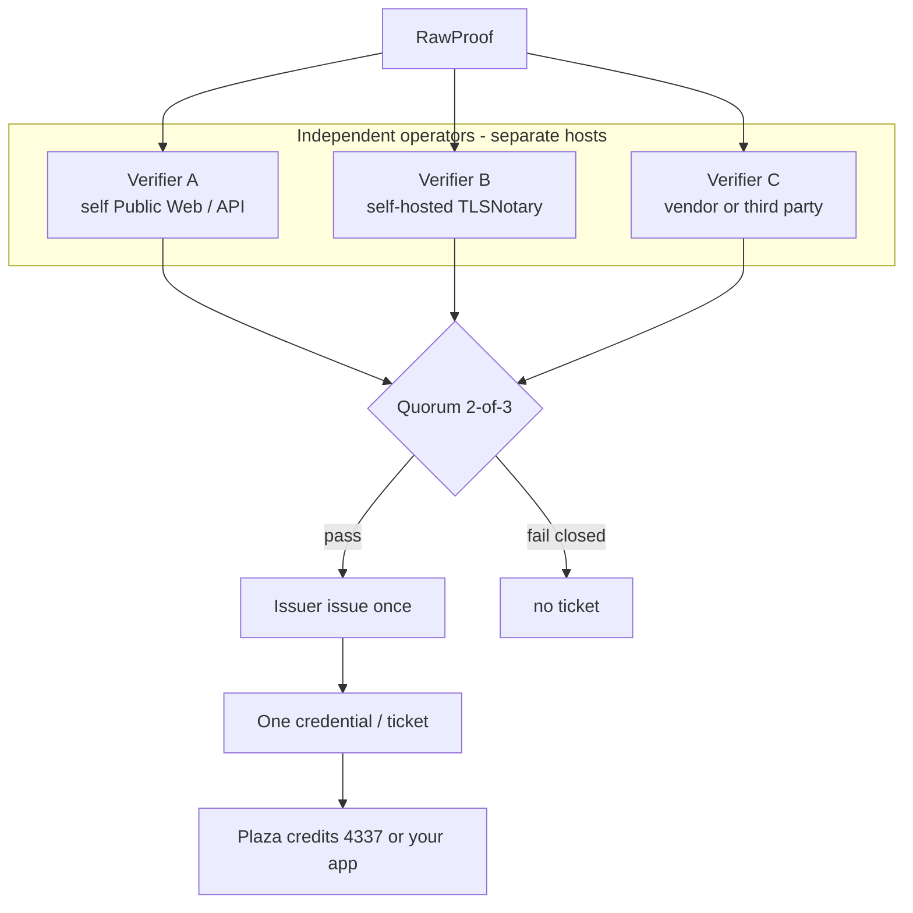

# Ecosystem — composable issuer and decentralized verify

English labels. This is the **intended** network. P1–P3 implement a single-operator `verify()` plus a pluggable `issue()`. P5 turns verify into a quorum. Do not claim we already run a verifier network.

## 1. Roles (not one process)

| Role | What it runs | Who |
| --- | --- | --- |
| Prover | Collects RawProof (browser, our worker, vendor SDK) | User device or an operator |
| Verifier operator | Independent `verify()` over the same proof / observation | At least three named parties in the 2-of-3 design |
| Issuer | `issue()` once after quorum | Our plaza issuer **or** another app’s issuer key |
| Consumer | Plaza, credits, 4337, or a third-party app | Reads the ticket only |

A verifier is **not** “a thread inside our API”. It is a separately deployed process (or a vendor’s hosted verify) with its own key, logged in `verifierSet`.

## 2. What “running our project” means for DVT

You do **not** run three copies of Task Plaza.

| You operate | Process | Notes |
| --- | --- | --- |
| Verifier | Kernel `verify()` worker (or TLSNotary notary, or vendor attestor) | Needs the RawProof or a fetch it can repeat |
| Issuer | Kernel `issue()` with the issuer key | One place; must not issue if quorum missing |
| Plaza pack | `packages/task` | Optional; only our ecosystem |
| 4337 adapter | Validator / paymaster + registry | Optional; checks the ticket, not TLS |

Network relation: verifiers gossip or post signed verify-receipts to the issuer (HTTPS, queue, or later an on-chain verifier registry). They are **not** a blockchain by default. P5c may add a registry of verifier keys; P3 `EvidenceRegistry` today only stores **our ticket hash**, not a DVT membership list.

## 3. Custom issuer (other developers)

Default profile = VeriCommons EIP-712 Evidence for the task ecosystem.

Another team:

1. Depend on `@vericommons/kernel` only.
2. Add schemas + `ProofBackend`s (own or vendor adapters).
3. Construct `createKernel({ signer: theirIssuer })`.
4. Later: swap ticket types (W3C VC) without rewriting verify.

Plaza wrappers stay ours. Their `issue()` is still “after verify”, still labeled with `trust.assumption`.

This is **designed** in the kernel split. A second credential codec is **not** shipped in P1–P3.

## 4. Do current packages satisfy the 3-verifier design?

| Need | Now | Gap |
| --- | --- | --- |
| Pluggable prove | Yes — backends in kernel | Vendor adapters are P4 |
| Record who verified | `proof.verifierSet`, `trust.assumption` | Only one verifier today |
| `verifyAll` + 2-of-3 | No | P5a–P5b |
| Separate verifier processes | Single kernel process | Deploy N verifier workers; issuer waits on receipts |
| Issuer after quorum | `issue()` exists | Must refuse unless quorum |
| Custom issuer key | `TicketIssuer` signer | Documented; no extra package |
| On-chain check of TLS | Must not | Validator only sees ticket — already true |
| Verifier registry | `EvidenceRegistry` is ticket hash | Extend or add a verifier-key registry in P5 |

So: the **kernel is the right shape** (backend-agnostic issue, trust labels). The **network of three verifiers is not running yet**. Shipping plaza on centralized verify is allowed; high-value credits should wait for quorum.

## 5. Sketch deployment (2-of-3)

1. Three operators deploy a verifier worker (container / Cloudflare Worker / TLSNotary notary). Different orgs, different keys.
2. One issuer service (ours for plaza, or theirs for a custom app) holds the `issue()` key.
3. Prover submits RawProof to all three (or issuer fans out).
4. Each verifier returns a signed verify-receipt.
5. Issuer counts receipts; on 2-of-3 calls `issue()`; ticket lists both `verifierSet`s.
6. Consumers unchanged: they only check our (or their) issuer signature.

Fail closed: one receipt → no ticket.

[SVG](./architecture-dvt.svg) · [P5 plan](./plan/P5-decentralized-verify.md)
