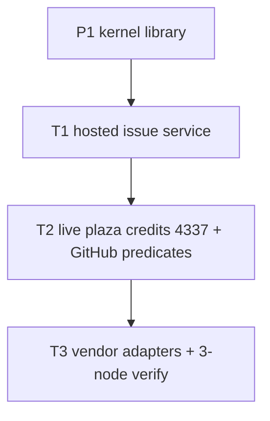

# T milestones — production (layered)

P1–P5 are the **protocol** slices (kernel → plaza → 4337 → vendors → DVT).  
T1–T3 are the **production** slices: turn the library into a hosted issuer, then wire live ledgers, then engines + three-node verify.

Do not skip T1 and call the stack production. Each T is built as Txa → Txb → … and checked before the next letter.

## Map onto P

| T | Depends on | Overlaps |
| --- | --- | --- |
| T1 Hosted issuer | P1 kernel | — |
| T2 Live consumers + more GitHub facts | T1 + P2/P3 adapters | P2/P3 stay libraries; T2 replaces in-memory |
| T3 Vendors + DVT | T1.5 (independent verify) | P4 + P5 |

---

## T1 — Hosted issuer (library → service)

**Gap today:** hosted `prove`/`issue` API still missing auth, replay, audit. T1.1 KMS client and T1.5 process-split verifier exist; GitHub still cannot independently re-fetch (token stripped).

| ID | Slice | Done when |
| --- | --- | --- |
| T1.1 | Issuer key in **AirAccount online KMS** (`https://kms.aastar.io`, `POST /kms/SignTypedData`). Process never sees raw key on disk. | `issue()` signs via `@vericommons/kms`; rotate by rotating agent JWT / keyId |
| T1.2 | Auth gateway in front of `prove` / `issue` (m2m for plaza, user token where needed) | Unauthenticated callers cannot mint tickets |
| T1.3 | Replay + rate limit: persist nonce, reject reuse, per-subject and per-IP caps | Duplicate `prove`/`issue` fails closed |
| T1.4 | Audit: who requested which schema/subject, ticket hash, verify result, no secrets in logs | Can answer “who issued this nonce” |
| T1.5 | Independent verify **process**: `@vericommons/verifier` (`POST /verify`). Predicate still runs on `RawProof` payload (GitHub cannot re-fetch without a token). Full independent re-fetch stays open. | Prove host ≠ sole verifier process |

**Exit:** one deployed issuer (staging) that plaza can call for `github.repo.star.v1` with a real token. Still **one operator**. Not DVT.

---

## T2 — Live consumers and more facts

**Gap today:** `InMemoryCreditLedger` / `InMemoryTaskStore`; 4337 contracts un-wired to the live account stack. Only GitHub **star** as an official-API schema.

| ID | Slice | Done when |
| --- | --- | --- |
| T2.1 | Credit adapter to the **existing** ledger API (`evidenceId, schema, subject, amount`). Delete in-memory as the production path | A PASS ticket grants real credits once |
| T2.2 | Task store durable (DB). Caps, once, window survive restart | Replay claim does not double-pay |
| T2.3 | Deploy `EvidenceTicketValidator` + registry; live 4337 module/paymaster consumes the same ticket | UserOp allowed iff ticket valid, no zkTLS in UserOp |
| T2.4 | GitHub predicates beyond star, one schema at a time: `pr.created` → `pr.merged` → org membership → fork (same backend, new schema + tests) | Plaza can assign those tasks without a new engine |

**Exit:** GitHub star (T1) plus at least one more GitHub schema, credits and 4337 on real systems. Public Web / attribution / NFT schemas already in kernel stay available; T2.4 is GitHub depth, not new vendors.

---

## T3 — Vendor engines and three-node verify

**Gap today:** no zkPass / Reclaim / zkEmail adapters. DVT is documented, not running. Verify is still one process (until T1.5, then still one org).

| ID | Slice | Done when |
| --- | --- | --- |
| T3.1 | P4 adapters: Reclaim (adapter only, no AGPL in kernel) → TLSNotary self-host → zkPass → zkEmail. Each sets `trust.assumption` | At least one vendor path issues **our** ticket |
| T3.2 | P5a–P5b: two then three **independent verifier hosts**; 2-of-3 then one `issue()`; fail closed | High-value schema requires quorum |
| T3.3 | Verifier-key registry (not the same as ticket-hash `EvidenceRegistry`) | Named set of verifier keys on-chain or in config |

**Exit:** production verify is a network of ≥3 operators for chosen schemas. Plaza/credits/4337 still only consume `issue()`.

---

## Checklist (do in order)

- [x] T1.1 KMS/HSM issuer (AirAccount `POST /kms/SignTypedData`, `@vericommons/kms`)
- [ ] T1.2 Auth gateway
- [ ] T1.3 Replay + rate limit
- [ ] T1.4 Audit log
- [ ] T1.5 Independent verify worker (process exists: `@vericommons/verifier`; GitHub re-fetch still open)
- [ ] T2.1 Live credits adapter
- [ ] T2.2 Durable task store
- [ ] T2.3 Live 4337 validator
- [ ] T2.4 GitHub PR / org / fork schemas
- [ ] T3.1 Vendor adapters (P4)
- [ ] T3.2 Three-node DVT (P5)
- [ ] T3.3 Verifier-key registry

Open one stacked PR per slice (T1.1, T1.2, …). Do not self-merge.
